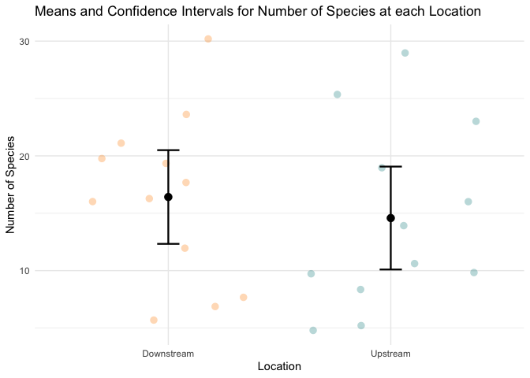
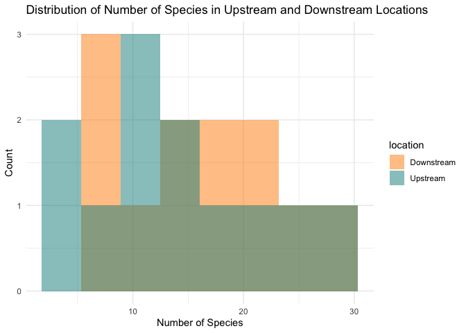

Lab 3 Report
================
MaryJo Nelson
2021-04-22

## Introduction

Researchers studying the number of electric fish species living in
various parts of the Amazon basin were interested in whether the
presence of tributaries affected the local number of electric fish
species in the main rivers (Fernandes et al. 2004).

They counted the number of electric fish species above and below the
entrance point of a major tributary at 12 different river locations.

The data is provided in your GitHub repository.

For each question below, write a sentence answering the question and
show the code you used to come up with the answer, if applicable.

``` r
library(tidyverse)
```

    ## ── Attaching packages ─────────────────────────────────────── tidyverse 1.3.0 ──

    ## ✓ ggplot2 3.3.3     ✓ purrr   0.3.4
    ## ✓ tibble  3.1.0     ✓ dplyr   1.0.5
    ## ✓ tidyr   1.1.3     ✓ stringr 1.4.0
    ## ✓ readr   1.4.0     ✓ forcats 0.5.1

    ## ── Conflicts ────────────────────────────────────────── tidyverse_conflicts() ──
    ## x dplyr::filter() masks stats::filter()
    ## x dplyr::lag()    masks stats::lag()

``` r
fish <- read_csv("chap12q19ElectricFish.csv")
```

    ## 
    ## ── Column specification ────────────────────────────────────────────────────────
    ## cols(
    ##   tributary = col_character(),
    ##   speciesUpstream = col_double(),
    ##   speciesDownstream = col_double()
    ## )

``` r
fish_long <- 
  pivot_longer(fish, speciesUpstream:speciesDownstream,
               names_to = "location",
               values_to = "species") %>% 
  mutate(location = str_remove(location, c("species"))) %>% 
  print()
```

    ## # A tibble: 24 x 3
    ##    tributary location   species
    ##    <chr>     <chr>        <dbl>
    ##  1 Içá       Upstream        14
    ##  2 Içá       Downstream      19
    ##  3 Jutaí     Upstream        11
    ##  4 Jutaí     Downstream      18
    ##  5 Japurá    Upstream         8
    ##  6 Japurá    Downstream       8
    ##  7 Coari     Upstream         5
    ##  8 Coari     Downstream       7
    ##  9 Purus     Upstream        10
    ## 10 Purus     Downstream      16
    ## # … with 14 more rows

## Question A

> What is the mean different in the number of species between areas
> upstream and downstream of a tributary? What is the 95% confidence
> interval of this mean difference. Show your code and write a sentence
> giving your answer

ANSWER

-   The mean difference is 1.83334
-   The 95% confidence interval of the mean difference is -4.587031 &lt;
    x &lt; 8.253697
-   I got these results by performing a t-test

``` r
ttest <- t.test(formula = species ~ location, data = fish_long)
ttest
```

    ## 
    ##  Welch Two Sample t-test
    ## 
    ## data:  species by location
    ## t = 0.59249, df = 21.81, p-value = 0.5596
    ## alternative hypothesis: true difference in means is not equal to 0
    ## 95 percent confidence interval:
    ##  -4.587031  8.253697
    ## sample estimates:
    ## mean in group Downstream   mean in group Upstream 
    ##                 16.41667                 14.58333

``` r
diff(ttest$estimate)
```

    ## mean in group Upstream 
    ##              -1.833333

## Question B

> Test the hypothesis that the tributaries have no effect on the number
> of species of electric fish.

ANSWER

-   Based on the t-test, we can fail to reject the hypothesis that
    tributaries have no effect on the number of species of electric fish
    for the following reasons:

    -   The p-value is greater than the assumed alpha of 0.05

    -   The confidence interval encompasses 0, meaning that the
        difference in the means could be 0

-   We can also conclude that the tributaries don’t seem to have an
    effect on the number of species present based on a graph showing the
    means and confidence intervals of both locations.

    -   The graph shows that there is significant overlap between the
        confidence intervals for areas upstream and downstream of
        tributaries, indicating that there is no real difference in the
        means.

``` r
fish_summary <-
  fish_long %>% 
  group_by(location) %>% 
  summarize(
    n = n(),
    mean = mean(species),
    sd = sd(species),
    sem = sd/sqrt(n),
    upper = mean + 1.96 * sem,
    lower = mean - 1.96 * sem
  ) 


fish_long %>% 
  ggplot(aes(x = location, y = species)) +
  geom_jitter(aes(color = location), 
              shape = 16, size = 3, 
              alpha = 0.3, width = 0.4) +
  geom_errorbar(aes(y = mean, ymax = upper, ymin = lower), 
                data = fish_summary, 
                width = .1, size = .8) +
  geom_point(aes(y = mean), 
             data = fish_summary, 
             size = 3) +
  scale_color_manual(values = c("darkorange","cyan4")) +
  theme_minimal() +
  guides(color = "none")
```

<!-- -->

## Question C

> State the assumptions that you had to make to complete parts (A) and
> (B). Create a graph to assess whether one of those assumptions was
> met.

ANSWER

-   The assumptions we had to make were that the sampling units were
    randomly sampled from the population and that the paired differences
    have a normal distribution in populations.

-   The distribution appears not to be normal, but rather is skewed
    right, meaning that that assumption was not met.

``` r
fish_long %>% 
  ggplot(aes(x = species)) +
  geom_histogram(
    aes(fill = location), 
    bins = 8, 
    alpha = 0.5, 
    position = "identity"
  ) +
  scale_fill_manual(values = c("darkorange","cyan4")) +
  theme_minimal()
```

<!-- -->
