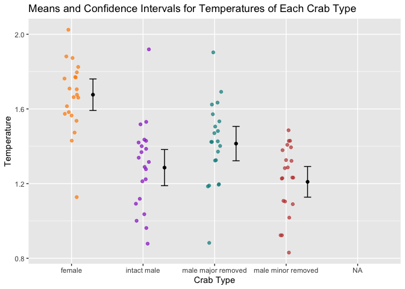

Lab 3 Report
================
MaryJo Nelson
2021-04-27

## Introduction

Researchers studying the number of electric fish species living in
various parts of the Amazon basin were interested in whether the
presence of tributaries affected the local number of electric fish
species in the main rivers (Fernandes et al. 2004).

They counted the number of electric fish species above and below the
entrance point of a major tributary at 12 different river locations.

The data is provided in your GitHub repository.

For each question below, write a sentence answering the question and
show the code you used to come up with the answer, if applicable.

### Question A

> What is the mean different in the number of species between areas
> upstream and downstream of a tributary? What is the 95% confidence
> interval of this mean difference. Show your code and write a sentence
> giving your answer

ANSWER

-   The mean difference is 1.83334
-   The 95% confidence interval of the mean difference is -4.587031 &lt;
    x &lt; 8.253697
-   I got these results by performing a t-test

<!-- -->

    ## 
    ##  Welch Two Sample t-test
    ## 
    ## data:  species by location
    ## t = 0.59249, df = 21.81, p-value = 0.5596
    ## alternative hypothesis: true difference in means is not equal to 0
    ## 95 percent confidence interval:
    ##  -4.587031  8.253697
    ## sample estimates:
    ## mean in group Downstream   mean in group Upstream 
    ##                 16.41667                 14.58333

    ## mean in group Upstream 
    ##              -1.833333

### Question B

> Test the hypothesis that the tributaries have no effect on the number
> of species of electric fish.

ANSWER

-   Based on the t-test, we can fail to reject the hypothesis that
    tributaries have no effect on the number of species of electric fish
    for the following reasons:

    -   The p-value is greater than the assumed alpha of 0.05

    -   The confidence interval encompasses 0, meaning that the
        difference in the means could be 0

-   We can also conclude that the tributaries don’t seem to have an
    effect on the number of species present based on a graph showing the
    means and confidence intervals of both locations.

    -   The graph shows that there is significant overlap between the
        confidence intervals for areas upstream and downstream of
        tributaries, indicating that there is no real difference in the
        means.

<!-- -->

### Question C

> State the assumptions that you had to make to complete parts (A) and
> (B). Create a graph to assess whether one of those assumptions was
> met.

ANSWER

-   The assumptions we had to make were that the sampling units were
    randomly sampled from the population and that the paired differences
    have a normal distribution in populations.

-   The distribution appears not to be normal, but rather is skewed
    right, meaning that that assumption was not met.

<!-- -->

## ANOVA

Fiddler crabs are so called because males have a greatly enlarged
“major” claw, which is used to attract females and to defend a burrow.

Darnell and Munguia (2011) recently suggested that this appendage might
also act as a heat sink, keeping males cooler while out of the burrow on
hot days.

To test this, they placed four groups of crabs into separate plastic
cups and supplied a source of radiant heat (60-watt light bulb) from
above. The four groups were intact male crabs, male crabs with the major
claw removed; male crabs with the other (minor) claw removed (control);
and intact female fiddler crabs.

They measured the body temperature of crabs every 10 minutes for 1.5
hours. These measurements were used to calculate a rate of heat gain for
every individual crab in degrees C/log minute. Rates of heat gain for
all crabs are provided in the accompanying data file.

### Question D

Graph the distribution of body temperatures for each crab type:

<!-- --><!-- -->

### Question E

Does body temperature varies among crab types? State the null and
alternative hypothesis, conduct and ANOVA, and interpret the results.

-   The null hypothesis for the ANOVA test is the that the temperature
    does not vary among crap types, and the alternative hypothesis is
    that the temperature of at least one crab type does vary from the
    rest.

<!-- -->

    ## Call:
    ##    aov(formula = temp ~ type, data = crabs)
    ## 
    ## Terms:
    ##                     type Residuals
    ## Sum of Squares  2.641310  3.467619
    ## Deg. of Freedom        3        80
    ## 
    ## Residual standard error: 0.2081952
    ## Estimated effects may be unbalanced
    ## 1 observation deleted due to missingness

    ##             Df Sum Sq Mean Sq F value Pr(>F)    
    ## type         3  2.641  0.8804   20.31  7e-10 ***
    ## Residuals   80  3.468  0.0433                   
    ## ---
    ## Signif. codes:  0 '***' 0.001 '**' 0.01 '*' 0.05 '.' 0.1 ' ' 1
    ## 1 observation deleted due to missingness

-   We can see from the ANOVA test that the p-value is 7e-10, which is
    significantly smaller than an assumed alpha of 0.05. This means that
    we can reject the null hypothesis and accept the alternative
    hypothesis that the temperature of at least one of the crab types
    varies from the others.

-   Based on the distribution and the graphed means and confidence
    intervals, we can see that female crabs appear to have higher
    temperatures than the other crab types.
